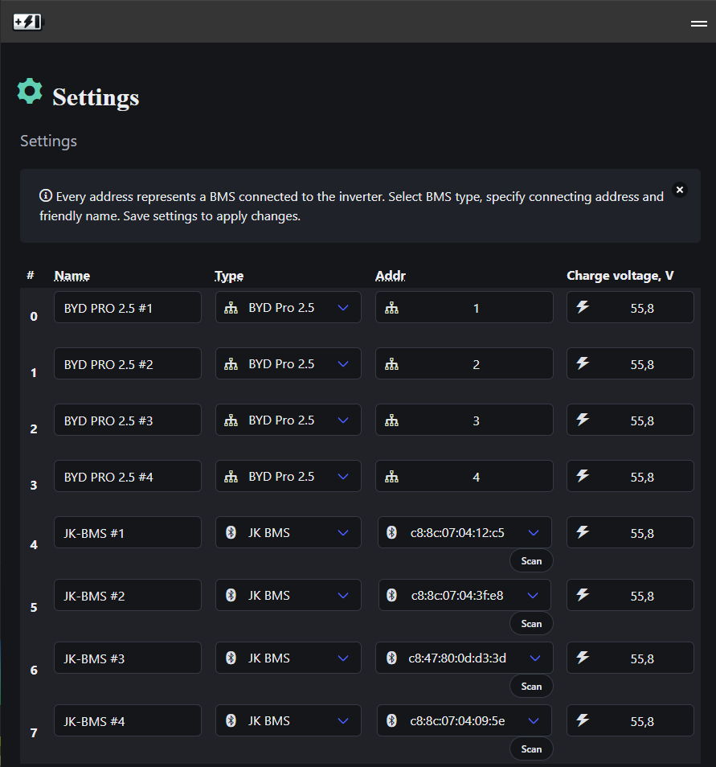

[](https://opensource.org/licenses/Apache-2.0) [](https://gitter.im/cesanta/mongoose-os?utm_source=badge&utm_medium=badge&utm_campaign=pr-badge)

# Virtual Battery Management System (BMS)

A versatile BMS proxy and aggregation system built on Mongoose OS for ESP32. This project enables monitoring and management of multiple Battery Management Systems through various communication protocols including RS485/MODBUS and Bluetooth LE.

## Features

- **Multi-BMS Support**: Connect and monitor up to 15 BMS units simultaneously
- **Multiple Protocols**: Support for RS485/MODBUS and Bluetooth LE communication
- **BMS Compatibility**:
  - BYD PRO series (RS485)
  - JK-BMS (Bluetooth LE and RS485)
- **Inverter Interface**: Native support for DEYE inverter protocol
- **Web Interface**: Built-in web dashboard for monitoring and control
- **RPC API**: HTTP, WebSocket, and MQTT RPC endpoints
- **Real-time Data**: Live monitoring with configurable refresh intervals

## Preview

### Main Dashboard

The web interface provides a comprehensive view of all connected BMS units with real-time monitoring capabilities:


### Settings Configuration

Easy-to-use settings interface for configuring BMS units, communication parameters, and system preferences:



### DEYE Inverter Integration

Virtual BMS seamlessly integrates with DEYE inverters, providing battery status through the inverter's communication protocol:


## Hardware Requirements

- ESP32 development board
- RS485 transceiver module (to connect VBMS to DEYE inverter)
- RS485 transceiver module (to connect VBMS to BMS units BYD B-Box Pro)
- Optional: CAN transceiver (for future CAN bus support)

## Installation

### Prerequisites

- [Mongoose OS CLI tool](https://mongoose-os.com/docs/mongoose-os/quickstart/setup.md)

### Configuration

1. Edit `mos.yml` to configure your setup:

   ```yaml
   # WiFi credentials
   wifi.sta.ssid: "YourWiFiSSID"
   wifi.sta.pass: "YourWiFiPassword"

   # UART configuration
   app.bms_uart_no: 2 # BMS UART port
   app.inv_uart_no: 1 # Inverter UART port

   # GPIO pins
   pins.led: 2 # Status LED pin
   pins.button: 0 # Reset button pin
   ```

2. Configure individual BMS units in `mos.yml`:

   ```yaml
   bms0.type: 1 # BYD PRO
   bms0.addr: "1" # MODBUS address
   bms0.name: "Battery Bank 1"

   bms1.type: 2 # JK-BMS BLE
   bms1.addr: "AA:BB:CC:DD:EE:FF" # BLE MAC address
   bms1.name: "Battery Bank 2"
   ```

### Build and Flash

#### WEB UI

```bash
cd vbms-web-ui
npm install
npm run build
```

#### Copy to fs

```bash
cp -r vbms-web-ui/dist/ fs/
```

#### Build firmware

```bash
# Build the firmware
mos build --platform esp32 --local

# Flash to ESP32
mos flash --port COM3

# Monitor console output
mos console
```

## API Usage

### Get BMS Summary Data

#### HTTP

```bash
curl http://192.168.1.100/rpc/VBMS.GetSummary
```

#### WebSocket

```bash
mos call --port ws://192.168.1.100/rpc VBMS.GetSummary
```

**Response Example:**

```json
{
  "timestamp": 1640995200,
  "bms": [
    {
      "addr": 1,
      "serial_no": "BYD12345678901234567890",
      "model": "BYD PRO 2.5",
      "last_update": 1640995195,
      "pack_voltage": 5520,
      "pack_current": -150,
      "remain_capacity": 4800,
      "cell_temp_avg": 25,
      "env_temp": 22,
      "warning": 0,
      "protection": 0,
      "fault_status": 0,
      "SOC": 85,
      "SOH": 98,
      "full_charge_capacity": 5000,
      "cycle_count": 127,
      "max_charge_current": 100,
      "nominal_float_voltage": 5520,
      "design_capacity": 5000
    }
  ]
}
```

### Scan for BLE BMS Devices

#### HTTP

```bash
curl -X POST http://192.168.1.100/rpc/VBMS.ScanBLE
```

#### WebSocket

```bash
mos call --port ws://192.168.1.100/rpc VBMS.ScanBLE
```

## Web Interface

Access the web dashboard at `http://[ESP32_IP_ADDRESS]` to:

- Monitor real-time BMS data
- View system status and connectivity
- Configure BMS settings
- Manage BLE device connections

## Configuration Parameters

| Parameter             | Description                             | Default       |
| --------------------- | --------------------------------------- | ------------- |
| `app.refresh_ms`      | BMS data refresh interval (ms)          | 1000          |
| `app.bms_uart_no`     | UART port for BMS communication         | 2             |
| `app.inv_uart_no`     | UART port for inverter communication    | 1             |
| `pins.led`            | Status LED GPIO pin                     | -1 (disabled) |
| `pins.button`         | Reset button GPIO pin                   | -1 (disabled) |
| `pins.button_hold_ms` | Button hold time for factory reset (ms) | 5000          |

## Supported BMS Types

| Type | Protocol     | Description          |
| ---- | ------------ | -------------------- |
| 1    | RS485/MODBUS | BYD PRO series       |
| 2    | Bluetooth LE | JK-BMS (BLE version) |

## Troubleshooting

### WiFi Setup

If WiFi credentials are not configured, the device will start in AP mode:

- SSID: `BMU-[ChipID]`
- Password: `12345678`
- Connect and configure via captive portal web interface

### Factory Reset

Hold the configured button pin for 5 seconds (default) to perform a factory reset.

### Debugging

Enable debug output by setting `debug.level` in `mos.yml`:

```yaml
debug.level: 3 # 0=Error, 1=Warn, 2=Info, 3=Debug
```

## License

This project is licensed under the Apache License 2.0 - see the [LICENSE](LICENSE) file for details.

## Contributing

1. Fork the repository
2. Create a feature branch
3. Commit your changes
4. Push to the branch
5. Create a Pull Request

## Authors

- **d4rkmen** - _Initial work_
